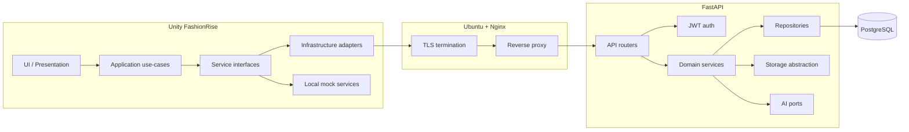

# FashionRise — Architecture overview

## Purpose

FashionRise is a **premium** fashion creation platform (not a casual dress-up game): realistic clothing design, sketching, data-driven materials and palettes, avatar preview, studio-style presentation, public profile/gallery (including **per-creator** public lists and **follow** feeds), PNG export, ratings (1–10), **AI sketch jobs** (OpenAI when configured), and future **designer handoff** depth.

## Platform targets

| Priority | Platform | Notes |
|----------|----------|--------|
| **v1 ship** | **Windows PC** (Unity standalone) | Primary desktop dev + builds |
| **v1 ship** | **Android** | Phone/tablet; gallery import plugin under `Assets/Plugins/Android/` |
| **Later** | iOS / iPadOS | Bundle id placeholder `com.fashionrise.ios`; not configured yet |
| Layout | Tablets + phones | Touch-first; `DeviceLayoutPolicy` adjusts density |
| Excluded for now | Web client | API designed so a web client could be added later |

## System context

## Architectural principles

### Unity client

- **Backend-independent UI**: Screens use presenters/view-models and call **application use-cases**, not HTTP or URLs.
- **Service interfaces** + **adapters**: Production REST lives in Infrastructure; **mock services** implement the same interfaces for offline work.
- **No giant MonoBehaviours**: Thin views; logic in plain C# and use-cases.
- **Data-driven catalogs**: Templates, materials, palettes from API + local cache/ScriptableObjects — not hardcoded in UI controllers.
- **Tablet-first**: Shared UI with layout/safe-area policy from Config.

### Backend

- **Thin routers**, **thick services**; **repositories** own SQLAlchemy access.
- **OpenAPI** is the contract; schemas match persisted domain concepts.
- **JWT**: short-lived access + refresh (server-stored, revocable).
- **Storage**: abstraction over local disk now; S3-compatible driver later.
- **AI**: stable job API and internal provider interface — **no** vendor SDKs embedded in route handlers.

### Cross-cutting

- **Idempotency** for expensive operations (uploads, AI jobs) where duplicates hurt.
- **Structured logging**, request correlation, health/readiness for ops.
- **Moderation- and admin-ready** fields on gallery/designs/users (see [Database](./04-database.md)).

## Related documents

- [Unity client](./02-unity-client.md)  
- [Backend](./03-backend.md)  
- [Database](./04-database.md)  
- [API](./05-api.md)  
- [Implementation phases](./06-implementation-phases.md)
