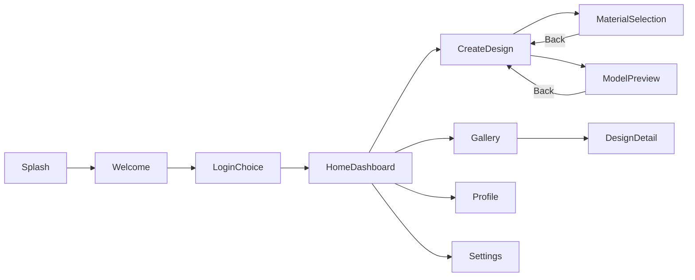

# FashionRise Unity — screen flow (V1)

## Payloads

- **DesignDetail**: `DesignDetailNavContext` with `GalleryItemId`.
- **Gallery** (optional): `GalleryNavContext` with **`OwnerUserId`** — loads **`GET /gallery/user/{id}`** instead of the global feed. When **`OwnerUserId`** is empty but the context is still passed, clears creator filter and applies optional **`CommunitySort`** (e.g. **Newest** from home **Gallery**, **Following** from **Following feed (gallery)**). **`payload == null`** (e.g. **Back**) leaves filter + sort unchanged so creator view survives returning from design detail.

## Notable interaction flows

- **CreateDesign handoff flow**: copy maker/spec-sheet JSON, generate `spec_sheet_pdf`, then open/share/download the generated PDF URL; desktop builds can open `persistentDataPath/Handoffs` directly.
- **DesignDetail handoff flow**: same handoff actions for owners (copy/generate/open/share/download/save), plus native share actions for gallery link and share card text with clipboard fallback.

## History

- `NavigationService` keeps a **stack** for `GoBackAsync`. Splash is never pushed.
- `[V2_READY]` modal overlays and tabbed home without losing stack discipline.
