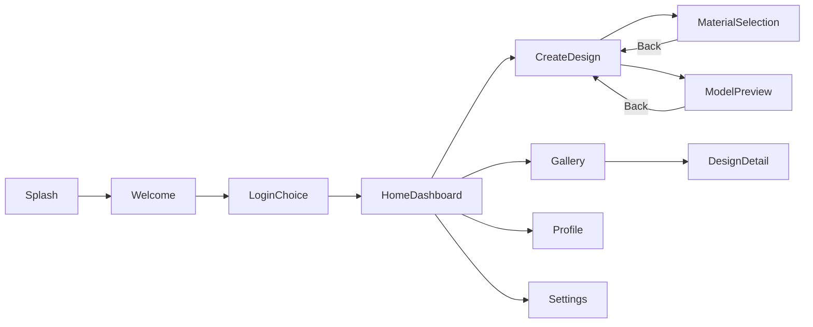

# FashionRise Unity — screen flow (V1)

## Payloads

- **DesignDetail**: `DesignDetailNavContext` with `GalleryItemId`.

## History

- `NavigationService` keeps a **stack** for `GoBackAsync`. Splash is never pushed.
- `[V2_READY]` modal overlays and tabbed home without losing stack discipline.
